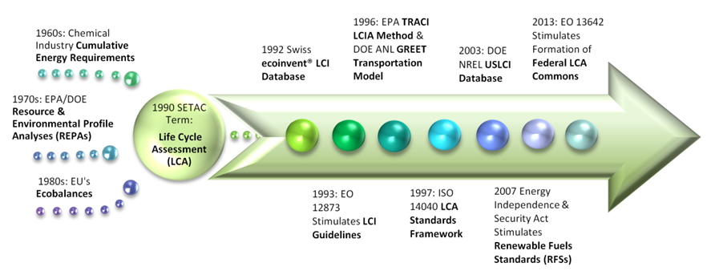
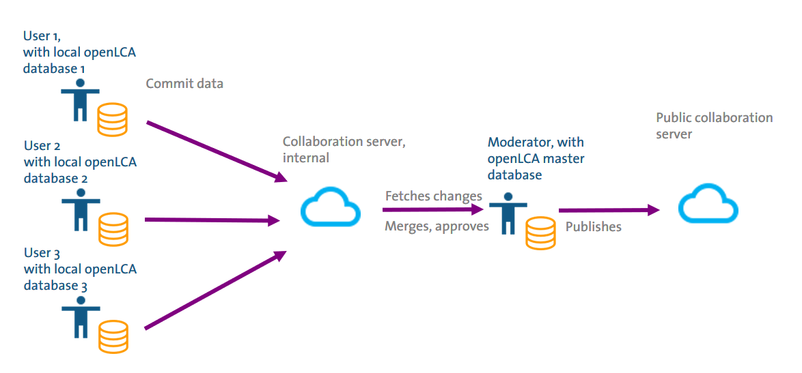

[**_Return to TOC_**](./toc.md)

# 1. 1 EERE &amp; the Federal LCA Commons

## 1.1 Introduction

The mission of the Department of Energy (DOE) Office of Energy Efficiency &amp; Renewable Energy (EERE) is to sustain American leadership in the transition to a global clean energy economy. From its establishment in 1973 to recent clean manufacturing and renewable energy initiatives, EERE has encouraged and leveraged technological advancements for a cost-effective, clean energy market (see Appendix A – EERE Timeline). Life cycle assessment (LCA) has become a critical tool in the assessment of clean energy technologies. This methodology is a systematic approach for quantitatively inventorying and assessing the environmental footprint of the entire life cycle of a product or service system. There is a need for such a holistic methodology to support analysis for decision-making in accomplishing the objectives of the EERE mission.

The US Federal LCA Data Commons, hereafter referred to as the &quot;Federal LCA Commons,&quot; is an interagency collaboration dedicated to providing access to and long-term preservation of US-based and federally-funded LCA data, tools, and resources. This set of repositories serves as a central point of access ([https://www.lcacommons.gov/lca-collaboration/search](https://www.lcacommons.gov/lca-collaboration/search)) for LCA resources developed across government agencies, as well as data from industry and academia through the US Life Cycle Inventory LCI (USLCI) Database ([https://www.nrel.gov/lci/](https://www.nrel.gov/lci/)). The Federal LCA Commons is not only a data source for the public but also a collaborative forum through which federal agencies may share developed data.

### 1.1.1 Overview of LCA Methodology &amp; Standards

In the last few decades, LCA has become a critical tool in the assessment of clean energy technologies. This methodology is a systematic approach for quantitatively inventorying and assessing the impacts of the entire supply chain and life cycle of a product or service system. Qualitatively, the first phase of an LCA is to define the goal and scope of the analysis. Once the system boundaries are identified, there are two quantitative aspects may to the methodology.

The first quantitative aspect of an LCA is to compile an LCI for the targeted system (e.g., a clean energy technology). The LCI normalizes the resource, material, and energy requirements as well as the outputs (i.e., products and by-products, waste, air/water/soil emissions) for each step in the product life cycle per unit product/service. A full inventory accounts for the product&#39;s entire life cycle, i.e., the production, use (which includes installation, maintenance, and decommissioning of the technology&#39;s components, where appropriate), and end-of-life (EOL) of the product. Establishing this inventory requires compiling inventory data from the ground up, piecing together existing inventories, or a combination of these approaches. Either way, the amassed LCI data contribute to building the library of datasets that can be used in subsequent analyses.

The second quantitative aspect of LCA is the life cycle impact assessment (LCIA). In this phase, the inventory items are categorized into lists based on their contribution to a set of environmental effects on resource and energy depletion or changes to air, water, and soil environmental compartments. The inventory items are then multiplied by standardized impact factor for that category. This set of computations provides a more comprehensive view of the per unit environmental footprint of the product for its entire life cycle. There are several impact assessment categories at local, regional, and global scales and there are established methods available for various geographic scopes and time periods. The TRACI methodology,1 which was developed for the US geographic scope by the US EPA, is the most common LCIA method employed for North American LCAs.

Cumulatively, the LCI and LCIA results of an LCA study allow the environmental impacts of the product to be evaluated relative to its benefits. Primarily, impact categories are those affecting resource availability, life support systems, human health, and biodiversity. The results are easily interpreted, especially when normalized to a reference situation (e.g., for each unit demanded in a given region, the kilograms CO2 equivalent contribution to the state, national, or global annual generation). Commonly assessed indicators in LCA may be inventory items (e.g., total energy or water consumption) or groups of inventory items to which impact factor multipliers have been applied (e.g., climate change impacts or respiratory effects).. Common impact assessments categories included in LCA studies are listed in Table 1; for a more comprehensive list, see in Appendix E – LCIA Impact Categories.
 

**Table 1. LCIA Impact Category Examples**

| Model/Method | LCIA Impact Category | Units |
| --- | --- | --- |
|**TRACI Midpoint**|Ecotoxicity | comparative toxic units (CTUe) |
|**TRACI Midpoint**| Global Warming Potential | kilograms CO2 eq |
|**TRACI Midpoint**| Human Health - Carcinogenics | comparative toxic units (CTUh) |
|**TRACI Midpoint**| Human Health – Non-Carcinogenics | comparative toxic units (CTUh) |
|**TRACI Midpoint**| Resource Depletion Potential(Fossil Fuels) | Mega Joules surplus |
|**ReCiPe Midpoint**| Climate Change | (kilograms CO2 eq) |
|**ReCiPe Midpoint**| Fossil Depletion | kilograms oil eq |
|**ReCiPe Midpoint**| Human Toxicity | kilogram 1,4-DB eq |
|**ReCiPe Midpoint**| Ionising Radiation | kilogram U235 eq |
|**ReCiPe Midpoint**| Metal Depletion | kilogram Fe eq |
|**ReCiPe Midpoint**| Water Depletion | m3 |
|**ReCiPe Endpoint**| Ecosystems – total | species/year |
|**ReCiPe Endpoint**| Human Health – total | DALY |
|**ReCiPe Endpoint**| Resources - total | $ |
 
 

The LCA approach is what is used to produce a carbon footprint—except only items affecting the climate change potential impact category are inventoried and assessed. Further, LCA results and information can be used to develop environmental labels. There are a number of voluntary standards for LCA&#39;s, carbon footprinting, and environmental labelling The primary set of standards for LCA are the ISO 14040 series but ISO standards have also been developed specific to carbon and water footprinting as well as environmental labelling (see Appendix B – LCA Standardsfor a complete list).

#### 1.1.2 Brief History of LCA in the US

Figure 2 shows the timeline of the LCA history overview. Use of life-cycle thinking began in the 1960s in the form of cumulative energy requirements for production of chemical products.6 The EPA was involved in refining the methodology throughout the 1970&#39;s to aid in data quality and standardization. Most early LCAs were performed by private and trade associations. The first full-scale study funded by a US Federal agency examined the environmental effects of producing wind energy system materials and was commissioned by the DOE&#39;s Solar Energy Research Institute (SERI) (i.e., now NREL). SERI also released the first public, peer-reviewed database in the same year. Throughout the 1980s, the EPA and DOE focused on energy systems and waste management while the European Union (EU) made more extensive use of the life-cycle methodology in policy development, calling these analyses &quot;Ecobalances.&quot; In 1990, the Conservation Foundation and the Society of Environmental Toxicology and Chemistry (SETAC) produced the term &#39;Life Cycle Assessment.&#39;

For the next 20 years, policies stimulated developments in data quality, availability, and standardization while private industry continued to use LCA to analyze and market their own products. The USLCI Database project began in 2001 when the US DOE directed NREL and the Athena Institute to explore the development of a national public database. The US LCI (USLCI) Database has been publicly available via [www.nrel.gov/lci](http://www.nrel.gov/lci) since 2003 and strives to provide publicly available LCI data following a consistent protocol.

The LCA approach significantly contributed to the development of biofuel emission thresholds and standards for the Renewable Fuels Standard (RFS) (USC 2007). There have also been a few cases of LCA study results supporting decision-making by the State of California (see the LCA Application section). In the EU, LCA has been used in policy development and decision-making for decades on a range of issues from battery recycling and chemicals regulation, to electrical and electronics equipment and other hazardous materials.
 
 

 
**_Figure 1. Brief History of Life Cycle Assessment (LCA)_**
 
 
 

#### 1.1.3 LCA Applications

As the LCA methodology has developed through the years, various Federal agencies have increasingly utilized the approach and developed tools to guide technical assessments. Increasing public access to LCA data has the potential to support policy-making, stakeholder decision-making, and citizen and consumer behaviors. In general, LCA can be used to evaluate product (or service) systems to set benchmarks, compare options, make decisions given specific criteria, and even evaluate economy-wide material and fuel substitution scenarios.

First, compiling, amassing, and maintaining LCI data sources facilitate LCAs that set benchmarks for existing product systems; LCA is a good fit for this endeavor because of its quantitative nature. The Federal LCA Commons provides a collaborative space for federal agencies to share LCI data and to host publicly available LCI data. In 2001, NREL was tasked with developing a database that provides individual gate-to-gate, cradle-to-gate and cradle-to-grave accounting of the energy and material flows into and out of the environment that are associated with producing a material, component, or assembly in the US. In 2011, the USDA National Agricultural Library launched www.lcacommons.gov based on the wealth of agriculture data from USDA surveys. This website, provides access to a wide variety of open data relevant to agriculture research and related domains, including agronomy, genomics, hydrology, soils, agro-ecosystems, sustainability science, and economic statistics. The lcacommons.gov began as a USDA data product by NAL with the goal of promoting interoperability and increased access to LCA resources from across the government. As the enterprise has continued, many other agencies have joined the working group and contribute to the overall effort. The NAL continues to manage and fund the development and implementation of the underlying technology supporting open access, data exchange, and interoperability—the LCA Collaboration Server. The Federal LCA Commons as a whole, hosted by NAL since 2012, currently provides data from NREL, NETL, USFS, EPA, ANL, and FHWA, effectively creating access to research and work products from these agencies. The NAL continues to provide technical support to the development of the USLCI and is working on deploying a new interface with a revised, agency-neutral presentation to link to all repository efforts under the Federal LCA Commons Working Groups (see Current Status of the Federal LCA Commons).

Next, LCI data from the quantitative benchmarks can be used to _compare_ product/service systems to alternative options, i.e., an alternate product or service system with the same benefits in comparative LCA studies. For example, LCA is used for &quot;apples-to-apples&quot; comparisons to evaluate the impacts of different renewable energy technologies, e.g., in the Renewable Portfolio Standards (RPS) report (Barbose 2018), the Renewable Electricity Futures Study (NREL 2012), the SunShot Vision Study (DOE 2012), and the Geothermal Vision Study Plan (DOE 2011).

Finally, the LCA methodology can be utilized to support decisions given specific environmental criteria, e.g., reducing greenhouse gases (GHGs) by a specific percentage.12 Further, the LCI data can be applied using the LCA methodology to support the evaluation of the life-cycle effects of economy-wide resource and supply chain substitution scenarios (e.g., switching the ratio of coal-to-natural gas for electricity production; transitioning to renewably-sourced electricity or electric vehicles).13

Overall, developing, maintaining, and sharing LCI data facilitates the use of LCA by federal agencies, which is a systematic and quantitative methodology to support decision-making in accomplishing the objectives of the EERE mission. Table 2 lists several examples of LCA agency-developed studies, data, or dynamic tools that are useful in supporting EERE mission objectives.
 
 

**Table 2. Example LCA Studies &amp; Programs Supporting EERE Mission Objectives**

| Setting Benchmarks | Comparing Options | Meeting Criteria |
| --- | --- | --- |
| NIST Building for Environmental &amp; Economic Sustainability (BEES) | LCI of Biodiesel &amp; Petroleum Diesel for Use in an Urban Bus (Sheehan, et al. 1998) | Pump Life Cycle Costs: A Guide to Life-Cycle Costing (LCC) Systems (DOE 2001) |
| NIST Building Industry Reporting &amp; Design for Sustainability (BIRDS) Software | EPA Sustainable Material Management Program | Electronic Product Environmental Assessment Tool (EPEAT) |
| DOE ANL Greenhouse Gases, Regulated Emissions, &amp; Energy Use in Transportation (GREET) Model | NREL LCA-Harmonization Project estimates of GHG emissions for renewable &amp; conventional electricity generation | Renewable Fuel Standard (RSF2) &amp; Vehicular GHG Reductions |
| NREL USLCI Database (USLCI) | EPA Sustainable Purchasing Program | Waste Reduction Model (WaRM) |
| NETL LCI Repository | Municipal Solid Waste Decision Support Tool (MSW-DST) | NIST Building for Environmental &amp; Economic Sustainability (BEES) framework |
| USDA NAL LCA Repository | Pump Life Cycle Costs (DOE 2001) | EPA Computational Toxicology: Using LCA for Risk Management (EPA 2011) |
| EPA US 2007 Industry Benchmark Model (EIO-LCA) | LCI of Biodiesel &amp; Petroleum Diesel for Use in Urban Bus (Sheehan et al. 1998) | GSA Sustainable Facilities Tool |
| Geothermal Vision Study Plan (DOE 2011) | Mobile Source Fuel Production Case Study (EPA 2017) | Federal Energy Management Program (FEMP) |
| SunShot Vision Study (DOE 2012) | DOE Solid-State Lighting Program LCA of Light Emitting Diode (LED) Lighting Products (EERE 2012) | NETL CO2 Sequestration &amp; Storage Assessments |
| Renewable Electricity Futures Study (NREL 2012) | EPA Design for Environment (DfE) Assessments | NETL Energy Technology &amp; Pathway Assessments |
| Pavement LCA Framework (FHWA 2016) | Material &amp; Energy Flows in Production of Lithium Ion Batteries (ANL 2014) | _DOE BER Potential for Electrified Vehicles to Contribute to US Petroleum and Climate Goals and Implications for Advanced Biofuels_ |
| Federal LCA Commons | Federal LCA Commons | Federal LCA Commons |
 
 

### 1.2 Current Status of the Federal LCA Commons

To date, the Federal LCA Commons is the result of coordinated work by NREL, the USDA the EPA, the NETL, the ANL, the USACE, the FHWA, the US Forest Service (USFS), the FAA, the DoD, and the NIST. The involved agencies are either LCA data developers/providers or users, with some operating as both. The LCA data needs for each agency depend on the specific agency&#39;s mission(s) (e.g., fossil fuels, buildings, transportation). However, the Federal LCA Commons provides a means of making the developed data available among agencies—making the connection for potential collaborations on data development and use. The largest LCA repositories are hosted by the USDA NAL, NREL (USLCI Database), and NETL. Several other significant datasets separately developed by NIST, USFS, ANL, and others have the potential to be integrated into the Federal LCA Commons through the ongoing coordination.

In 2013, the Obama Administration gave the Executive Order (EO) 13642 requiring agencies to increase machine-readability and access to data and metadata compiled by federally-funded entities. In 2014, an ad-hoc working group was formed between the USDA, EPA, NETL, ANL, and NREL. This group laid the groundwork for improving access to, consistency of, and interagency collaboration for the Federal LCA Commons. Though the involved agencies have often, historically worked in silos for many LCA-related projects, this collaboration has developed more streamlined processes for curating and providing public access to LCI data and data documentation. As a coordinated, multi-agency effort, the Federal LCA Commons endeavors to provide improved and coordinated access to Federal LCA data. The Federal LCA Commons supports the richness and utility of DATA.GOV as per the Open-Data Rules to enhance government efficiency and fuel economic growth.

Currently, the Federal LCA Commons contains repositories from multiple agencies, including the USDA NAL agricultural data sets for field crops, swine, poultry, and beef; NREL&#39;s US LCI covering commonly used materials, products, and processes such as utilities, transportation, fuel production and delivery, common chemicals, plastic resins, and paper and metal products; NETL&#39;s coal production data sets; EPA&#39;s US Environmentally Extended Input-Output (EEIO) model; USFS Forest Product&#39;s Lab datasets, and several agricultural and biofuel repositories.. All are now available via the Federal LCA Commons ([www.lcacommons.gov](http://www.lcacommons.gov)) portal and several additional repositories from aforementioned and additional member agencies are slated for near-term launching. An active Technical Working Group comprised of Federal LCA Commons members coordinates advancing standards for formatting and documentation as well as updates to the platform and content. Several work products have been published as the result of direct collaboration and shared funding between NREL, USDA, NETL and EPA, including for example: coal extraction models, a revised and more usable USLCI, and a baseline electricity dataset. All Federal LCA Commons data are published based on a consistent scheme, the schema of openLCA, free open-source LCA software provided by GreenDelta.

LCA modeling is quite resource and time intensive, not to mention cumbersome without LCA-dedicated software. To date, most LCA software packages have been commercial—licensing for around $10,000 per year—making LCA relatively cost-prohibitive to many users. In 2006, GreenDelta started the openLCA project. This project has led to the creation of openLCA, a high-performance, reliable, fully transparent, and dedicated LCA software. The open-source, open-data platform is DKAN (i.e., Drupal-based, community-driven) with a full suite of cataloging, publishing, and visualization features for structured data. Both of these tools allow agencies and organizations to easily share LCA data with each other and the public (see Figure 2). Therefore, users may submit and access both structured LCI data and LCA-related data that are not necessarily formatted for an inventory database. Through the openLCA desktop application, modelers can also access the work of others on the Collaboration Server either through shared repositories or through the Federal LCA Commons search application.
 
 

**_Figure 2. Federal LCA Commons Collaboration Server Structure; where Users = Federal Agency Representatives._**
 
 

The near-term goal for the Federal LCA Commons is to provide a single-access point for US LCA data that comply with guidance provided by the International Organization for Standardization (ISO) on LCA data documentation formats and those on digital information preservation and access, ISO/TS 14048:200214 and ISO 14721:201215, respectively.

In order to move toward interoperability and transparency, the group is focusing on the harmonization of documentation standards as well as digital data access and preservation to increase the collaboration potential and reviewability of the LCA data exchange process. Increased harmonization of metadata and documentation standards among agencies and stakeholders developing LCA data will significantly reduce not only data acquisition costs but also computer- and human-based misinterpretation errors, and thus, data misuse.

The long-term goal for the Federal LCA Commons is to provide a single LCA data framework, i.e., a mega-repository for the US geographic scope. Establishing this framework will require a formal interagency group and the compilation of single core datasets (i.e., for commonly utilized US resources such as electricity, fuels, transports, materials, etc.). With a searchable, common LCI and LCA data repository, there will be enhanced federal agency and public access to Federal LCI data. With a single set of core US datasets available for incorporation into LCA studies, energy system assessments become exponentially more representative and comparable and, therefore, substantive.

Overall, the Federal LCA Commons will provide advanced LCI data, research, and information as well as a collaborative forum for multiple agencies to continue developing, sharing, and using the LCA methodology to meet their respective and the overall EERE mission objectives. This initiative will improve consistency in LCA methods for decision-making and public disclosure.
 
 

[**_Return to TOC_**](./toc.md)
