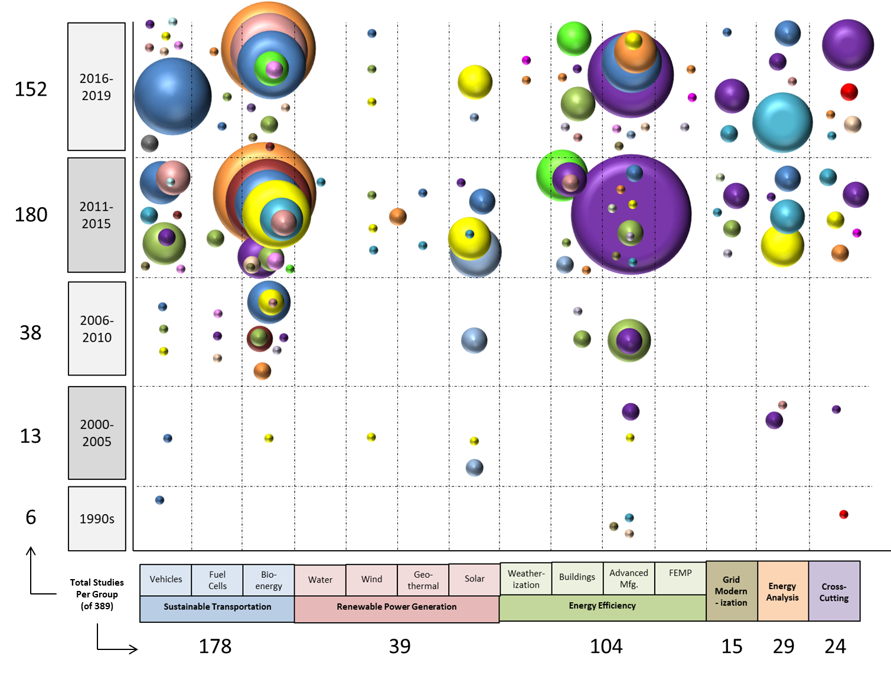

[**_Return to TOC_**](./toc.md)

# 2. Federal LCA Commons Benefits &amp; Challenges

The Federal LCA Commons presents multiple benefits to federal agencies and the general public. The methodology can be used to evaluate energy technology scenarios and present comprehensive information to policymakers and invested stakeholders. This information can facilitate systematic comparisons between policy options regarding environmental decisions. The quantitative nature of the LCA methodology can contribute input to the measuring and monetizing of environmental externalities as well as identifying environmental hotspots in the entire life cycle of products and systems, revealing how resources should be applied for the greatest benefit. Even indirect (i.e., upstream or supply chain-related) hotspots can be identified; that is, both products and product systems can be targeted for improved environmental performance.

Despite the benefits of the LCA methodology, conducting LCA studies is very data intensive and can be cost-prohibitive for many stakeholders. In the long-term, the Federal LCA Commons is intended to provide to the public a single-access point for ISO-compliant LCI data generated by federal organizations or through federally-funded projects and covering the US economy.

To retain and extend the benefit of this resource to interested stakeholders, interagency coordination must be increased.

The Federal LCA Commons has the advantage of multi-agency resources and expertise to advance the suite of databases, research, and information. As interagency coordination increases, a new standard for data formats and documentation is advanced. As agency efforts and protocols are aligned, existing agency data pools can be mined to expand LCI databases and improve data completeness. Larger, more complete databases using a common format and access portal make leaps toward database interoperability and transparency criteria.

In shifting the Federal LCA Commons to the Collaboration Server, which compliments the open-source LCA software, data accessibility to the public will be exceptionally improved. This standardization will not only avoid duplicate work between agencies but provides a collaborative forum through which agencies can coordinate LCI data development while improving the uniformity and transparency of existing and future LCI datasets.

As a primary long-term goal, the collaborative platform will also set the stage for the creation and compilation of a set of core background LCA datasets representative of the US economy. These datasets can be used across agencies and projects to increase consistency in Federal LCA analyses efforts. The platform, format, and core dataset standardizations will progress the reliability of LCA study results. Improved reliability and public access to US LCI information, paves the way to higher quality, lower cost US LCA studies with fewer misinterpretation errors, an outcome that has great potential to support US industry competitiveness.

## 2.1 Supporting the EERE Mission

The LCA methodology can contribute greatly to the EERE mission to &quot;create and sustain American leadership in the transition to a global clean energy economy&quot; (EERE 2016). LCA is well-suited for analysis of energy systems and energy efficiency because it is holistic; that is, it assesses a more complete picture than stack or tailpipe emissions, evaluates a broad spectrum of emission types, and allows deterministic comparisons to bring comprehensibility to options or scenarios. Certainly, these quantitative systems approaches can aid in evaluating success indicators for EERE&#39;s strategic plan goals. For example, the LCA methodology supports:

- Assessing GHG emission reductions for hydrocarbon biofuel technology pathways
- Assessing life cycle energy savings of efficiency initiatives for existing and new homes, buildings, and industries
- Assessing the reduction of energy consumption of EERE-targeted manufactured goods
- Assessing scope 1 and 2 GHG emission reductions from federal facilities
- Assessing GHG emission reductions from the DOE complex

As LCI data availability improves and the methodology advances, LCA can increasingly be used to support regulatory analyses. The LCA approach can contribute valuable information to aid decision-making that decreases compliance costs, thereby improving US business effectiveness and competitiveness.

To date, the LCA methodology has been use in US policy in developing:

  - Product-oriented policies (eco-labeling/green purchasing)
  - Deposit-refund schemes (including waste management policies)
  - General process-oriented policies (e.g., toxic substance management)
  - Reveal policy mix for most beneficial environmental outcomes (policies implemented at various points in life cycle)

Further, the methodology has been utilized:

  - As a decision support tool in several US states (Schenck 2009)
    - CA State Office Pollution Prevention &amp; Technology Department: Shredder residue assessment &amp; hazardous waste mgmt. (CA DTSC)
    - State programs for LCA
    - Green Seal and other businesses
  - To support environmental purchasing decisions
    - 1993: Clinton EO 12873 for Green Purchasing Decisions
    - EPA framework for Responsible Environmental Decision-Making (FRED) = practical methodology to guide environmentally preferable purchasing
  - In the USFS to make recommendations for design professionals to use reused vs. virgin wood products (Bergman 2009)

LCA differs from conventional environmental policy-making. Consider that conventional thinking often results in corrective, &#39;end-of-pipe&#39; or &#39;last-minute&#39; technology Band-Aid-type solutions that apply to only a single environmental compartment and/or life cycle stage at a time (e.g., only air emissions at production or water emissions at waste management). This type of approach can easily result in burden shifting. In contrast, LCA thinking is proactive, preventative, more comprehensive and systematic; and assesses all environmental compartments at all life cycle stages (e.g., air/water/soil emissions at production, use and EOL). Life cycle thinking also acknowledges the interconnectedness of environment and economy. For example, LCA data reveal that advanced biofuels can reduce carbon emissions relative to corn ethanol leading to a cap on corn ethanol used to satisfy the RFS in 2015. Additionally, comparing the environmental burdens imposed for maintenance required per kilowatt-hour of conventional coal-fired plant electricity to that for renewable distributed renewable energy, e.g., micro-grid systems, the coal generation will appear more efficient. However, an LCA comparison of the entire life cycle of these systems indicates an approximate 10-fold decrease in environmental burdens across impact categories projected for the renewable systems.

## 2.2 Federally-Funded LCA Studies &amp; Data

The continued and improved LCA support in benchmarking and decision-making for achieving EERE objectives that serve the public depends on increasing interagency coordination. Within government agencies, access to a common set of US-specific datasets can advance research on energy savings for electricity generation, transportation and infrastructure systems, public buildings, and even industry and manufacturing.

The LCA methodology may also be used in the evaluation of sustainable transportation technologies; electric power from renewable sources; the energy efficiency of homes, buildings, and industries; the thriving domestic clean energy manufacturing industry; clean energy integration into a reliable, resilient, and efficient grid; improvement of federal sustainability and implementation of clean energy solutions in federal agencies; and enabling a results-driven culture via management. Finally, LCA can be used in research and development investments aimed at speeding up the pace of innovation and strengthening domestic manufacturing and supply chains. Accordingly, LCA can also be used to evaluate various supply chain configurations (e.g., energy sourcing, distribution distances/configurations, and raw materials supplier proximity).

Figure 3 displays instances where LCA has been used in federal research endeavors to analyze energy systems and energy efficiency issues that correlate with EERE&#39;s mission-critical support operations. Over 150 research projects involving LCA to analyze an EERE mission-critical support operation were categorized into those relevant to:

1. Sustainable transportation
2. Renewable power generation
3. Energy efficiency
4. Grid modernization
5. Energy analysis
6. Cross-cutting

The broad coverage of EERE mission-critical support operations by Federal LCA Commons members and DOE-funded entities indicates that LCA is critical to the path forward.

 
 

 
 
**_Figure 3. LCA Studies by Federal LCA Commons Members, DOE Agencies, and National Laboratories Relevant to EERE Mission-Critical Operations_**
(Bubble size represents number of studies performed and color correlates to specific agency or lab; total is 389 studies; see bibliography in Appendix G)
 
 
 

 
 

**_Table 3. Legend to Figure 3. Bubble Chart LCA Studies by Federal LCA Commons Members &amp; DOE Agencies_**
 
 
 
 

# Conclusion

This report describes the mission of the DOE EERE and the relevance of the LCA methodology and the Federal LCA Commons to this mission. An overview of the LCA methodology, its history in the US, current standards, and practical applications shows that LCA is useful in supporting EERE mission objectives. In response to open government initiatives and multi-agency collaboration, the Federal LCA Commons is advancing new data format and documentation standards. Recent developments include converting multiple agency databases to a common repository, the Federal LCA Commons Collaboration Server. The now multi-agency, public repository is focusing on harmonizing digital data access and preservation to increase the collaboration potential and reviewability of the LCA data exchange process.

As federal efforts and protocols are aligned, existing federal data pools can be mined to expand LCI databases and improve data completeness. Larger, more complete databases using a common format and access portal will make a quantum leap toward achieving interoperability and transparency criteria in federally available life cycle data.

The coordination and standardization efforts improve the uniformity and transparency of the LCI data, which progresses the reliability of LCA study results incorporating these data. Improved reliability and public access to US LCI information paves the way to higher quality, lower cost US LCA studies with fewer misinterpretation errors and uncertainty due to data gaps; an outcome that has great potential to support US industry competitiveness.
 
 
 

[**_Return to TOC_**](./toc.md)
