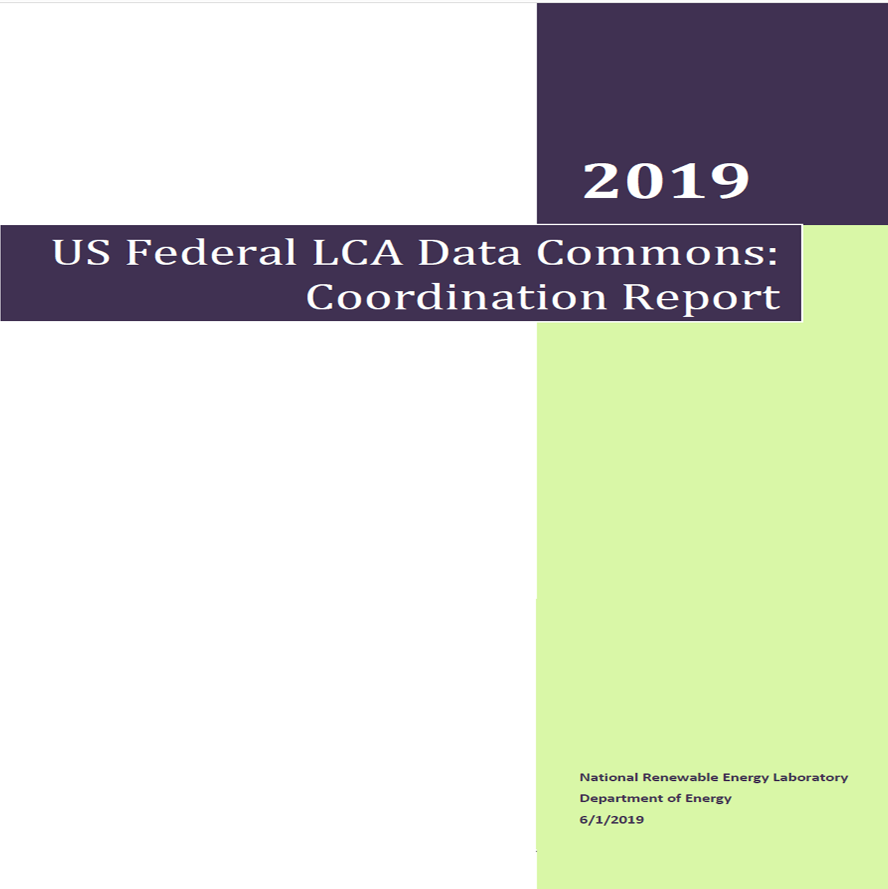

# WELCOME TO THE 2019 NREL FEDERAL LCA COMMONS COORDINATION REPORT

# Table of Contents

## [ACRONYMS &amp; ABBREVIATIONS](../00-acronyms.md)

## [PREFACE](./00-preface.md)  

### [1        EERE &amp; the Federal LCA Commons](./01-eere.md)     

#### 1.1        Introduction       

##### 1.1.1        Overview of LCA Methodology &amp; Standards   

##### 1.1.2        Brief History of LCA in the US     

##### 1.1.3        LCA Applications  

#### 1.2        Current Status of the Federal LCA Commons      

### [2        Federal LCA Commons Benefits &amp; Challenges](./02-benefits.md)

#### 2.1        Supporting the EERE Mission 

#### 2.2        Federally-Funded LCA Studies &amp; Data

#### 2.3        Conclusion 

## [REFERENCES](./references.md)

## [Appendix A – EERE Timeline](./a-timeline.md)

## [Appendix B – LCA Standards](./b-standards.md)

## [Appendix C – Existing LCI Databases](./c-databases.md)

## [Appendix D – Federal Agency Data Pools](./d-data_pools.md)

## [Appendix E – LCIA Impact Categories](./e-impacts.md)

## [Appendix F – Bibliography for Figure 3 Federal LCA Studies Bubble Chart](./f-bibliography.md)
